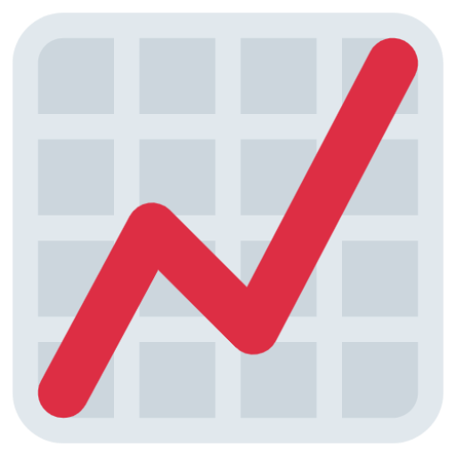

<div id="top"></div>
<!--
*** Thanks for checking out the Best-README-Template. If you have a suggestion
*** that would make this better, please fork the repo and create a pull request
*** or simply open an issue with the tag "enhancement".
*** Don't forget to give the project a star!
*** Thanks again! Now go create something AMAZING! :D
-->


<!-- PROJECT SHIELDS -->
<!--
*** I'm using markdown "reference style" links for readability.
*** Reference links are enclosed in brackets [ ] instead of parentheses ( ).
*** See the bottom of this document for the declaration of the reference variables
*** for contributors-url, forks-url, etc. This is an optional, concise syntax you may use.
*** https://www.markdownguide.org/basic-syntax/#reference-style-links
-->
[![Contributors][contributors-shield]][contributors-url]
[![Forks][forks-shield]][forks-url]
[![Stargazers][stars-shield]][stars-url]
[![Issues][issues-shield]][issues-url]
[![LinkedIn][linkedin-shield]][linkedin-url]


<!-- PROJECT LOGO -->
<br />
<div align="center">
  <a href="https://github.com/erohs/pebbletor">
    
  </a>

<h3 align="center">Pebbletor</h3>

  <p align="center">
    A MERN stack application used to create hill charts with live collaboration using web sockets. 
    <br />
    <a href="https://github.com/erohs/pebbletor"><strong>Explore the docs »</strong></a>
    <br />
    <br />
    <a href="https://github.com/erohs/pebbletor">View Demo</a>
    ·
    <a href="https://github.com/erohs/pebbletor/issues">Report Bug</a>
    ·
    <a href="https://github.com/erohs/pebbletor/issues">Request Feature</a>
  </p>
</div>


<!-- TABLE OF CONTENTS -->
<details>
  <summary>Table of Contents</summary>
  <ol>
    <li>
      <a href="#about-the-project">About The Project</a>
      <ul>
        <li><a href="#built-with">Built With</a></li>
      </ul>
    </li>
    <li>
      <a href="#getting-started">Getting Started</a>
      <ul>
        <li><a href="#prerequisites">Prerequisites</a></li>
        <li><a href="#installation">Installation</a></li>
      </ul>
    </li>
    <li><a href="#roadmap">Roadmap</a></li>
    <li><a href="#contributing">Contributing</a></li>
    <li><a href="#contact">Contact</a></li>
    <li><a href="#acknowledgments">Acknowledgments</a></li>
  </ol>
</details>


<!-- ABOUT THE PROJECT -->
## About The Project

[![Pebbletor Screenshot Light Mode][product-screenshot-1]](https://pebbletor.netlify.app/)
[![Pebbletor Screenshot Dark Mode][product-screenshot-2]](https://pebbletor.netlify.app/)

Our team had recently switched to creating hill charts as a means of better visualising project progression. These hill charts were created using [Miro](https://miro.com/), which meant team effort had to go into creating, maintaining and updating these charts. Pebbletor is my way of speeding up this process by separating what we had into a standalone app.
Pebbletor will take everything that we enjoyed about using Miro:
* Cusomisation 
* Ease of access
* Live collaboration
And expand upon it, bringing much more value to us whilst being less of a time sink for the development team. It will provide a platform for expansion into <a href="#roadmap">valuable features</a>
 

<p align="right">(<a href="#top">back to top</a>)</p>


### Built With

* [Mongoose.js](https://mongoosejs.com/)
* [Express.js](https://expressjs.com/)
* [React.js](https://reactjs.org/)
* [Node.js](https://nodejs.org/en/)
* [D3.js](https://d3js.org/)
* [Socket.io](https://socket.io/)
* [Axios](https://axios-http.com/)
* [Typescript](https://www.typescriptlang.org/)

<p align="right">(<a href="#top">back to top</a>)</p>


<!-- GETTING STARTED -->
## Getting Started

This is an example of how you may give instructions on setting up your project locally.
To get a local copy up and running follow these simple example steps.

### Prerequisites

This is an example of how to list things you need to use the software and how to install them.
* npm
  ```sh
  npm install -g npm@latest 
  npm install -g nodemon
  ```

### Installation

1. Get mongoDB Atlas free at [https://www.mongodb.com/](https://www.mongodb.com/)
2. Clone the repo
   ```sh
   git clone https://github.com/erohs/pebbletor.git
   ```
3. Install NPM packages in the client and server folder
   ```sh
   npm install
   ```
4. Enter your MongoDB Atlas URI in `.env` within the server folder
   ```js
   ATLAS_URI='ENTER YOUR URI';
   ```
   or
   ```js
   ATLAS_URI='mongodb://localhost:27017/hillchart';
   ```
   for local development
5. Change the baseUrl within `index.ts` within the client api folder
   ```js
   const baseUrl = 'ENTER SERVER DEPLOYMENT URL';
   ```
   or
   ```js
   const baseUrl = 'http://localhost:5000';
   ```
   for local development
6. Start your server from the server folder or run your backend deployment
   ```sh
   nodemon server.js
   ```
7. Start the client or run your front end deployment
   ```sh
   npm start
   ```

<p align="right">(<a href="#top">back to top</a>)</p>


<!-- ROADMAP -->
## Roadmap

- [] Custom images
    - [] Marker images
    - [] Hill Chart background
- [] User accounts
- [] Stat tracking
    - [] Marker history system
    - [] Reporting on stats
- [] Jira integration
    - [] Sync issues from epic
    - [] Place synced issue onto chart
- [] Copy chart as PNG (Default Styling)
- [] Daily / Weekly objectives

See the [open issues](https://github.com/erohs/pebbletor/issues) for a full list of proposed features (and known issues).

<p align="right">(<a href="#top">back to top</a>)</p>


<!-- CONTACT -->
## Contact

Jacob Shore - [@jerohzdev](https://twitter.com/jerohzdev) - jashore@hotmail.co.uk

Project Link: [https://github.com/erohs/pebbletor](https://github.com/erohs/pebbletor)

<p align="right">(<a href="#top">back to top</a>)</p>


<!-- ACKNOWLEDGMENTS -->
## Acknowledgments

* [freeCodeCamp MERN Stack Tutorial](https://www.youtube.com/watch?v=ngc9gnGgUdA&t)
* [Basecamp Hill Charts](https://basecamp.com/features/hill-charts)
* [README Template](https://github.com/othneildrew/Best-README-Template)

<p align="right">(<a href="#top">back to top</a>)</p>


<!-- MARKDOWN LINKS & IMAGES -->
<!-- https://www.markdownguide.org/basic-syntax/#reference-style-links -->
[contributors-shield]: https://img.shields.io/github/contributors/erohs/pebbletor.svg?style=for-the-badge
[contributors-url]: https://github.com/erohs/pebbletor/graphs/contributors
[forks-shield]: https://img.shields.io/github/forks/erohs/pebbletor.svg?style=for-the-badge
[forks-url]: https://github.com/erohs/pebbletor/network/members
[stars-shield]: https://img.shields.io/github/stars/erohs/pebbletor.svg?style=for-the-badge
[stars-url]: https://github.com/erohs/pebbletor/stargazers
[issues-shield]: https://img.shields.io/github/issues/erohs/pebbletor.svg?style=for-the-badge
[issues-url]: https://github.com/erohs/pebbletor/issues
[linkedin-shield]: https://img.shields.io/badge/-LinkedIn-black.svg?style=for-the-badge&logo=linkedin&colorB=555
[linkedin-url]: https://linkedin.com/in/jacob-shore-a0101a199
[product-screenshot-1]: images/PebbletorHillChartLight.png
[product-screenshot-2]: images/PebbletorHillChartDark.png